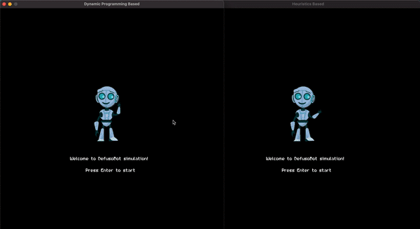
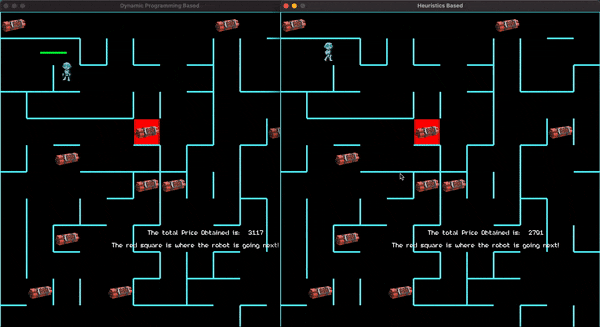

# DefusoBot Simulation

A simulation to visualise a particular application of the Cost-Constrained Travelling Salesman problem. Built in C++, using SDL2.

Part of Task 2 of course COP290: Design Practices, second (fall) semester, 2020.

## Problem formulation
  
Like the Traveling Salesman Problem, the Cost-Constrained Traveling Salesman Problem can be formulated as an optimization problem. Given a set of nodes {1,2,..,,n}, a non-negative cost matrix C = cij, positive values {v1,v2,...,vn}, and a budget B;

   
  

For more details, refer to the complete [report](assets/report.pdf).

## Installation Instructions

The game was built and tested on macOS Big Sur (ver 11.3 onwards). To install dependencies using homebrew, run:

~~~
brew install sdl2
brew install sdl2_ttf
brew install sdl2_mixer
brew install sdl2_gfx
~~~

or simply run `make setup`

## Instructions for use

The user has a choice of running the simulation with the DP-based algorithm or the Heuristic-based algorithm. To start these, clone the repo and then run:
~~~
make build
./simulation 0
./simulation 1
~~~
Where the last 0 chooses DP-based algorithm and 1 choses Heuristics based algorithm.

## Example working simulation

  
   
  Example Simulations

In the first example, it can be seen that the two algorithms give the exam same profit, and that the actual paths differ only in one or two places. In the second example (second half of the video), the two algorithms give very different paths, and yet their profits were very close. Upon closer inspection, we observed that one of the nodes had slightly higher profit than another, but was also a bit costlier than the other (still within budget). The profit/cost used in the heuristic, thus, was greater for the latter, and the heuristic-based algorithm gave preference to that node over the other.